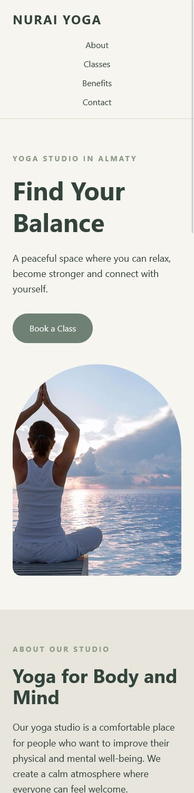
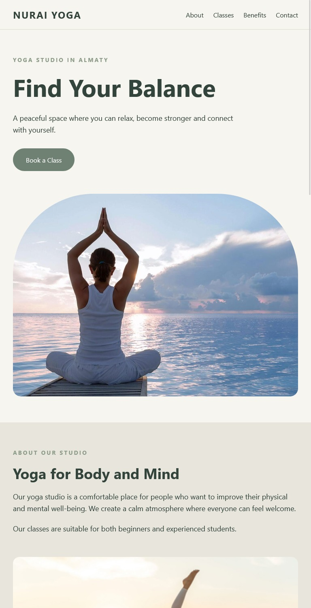
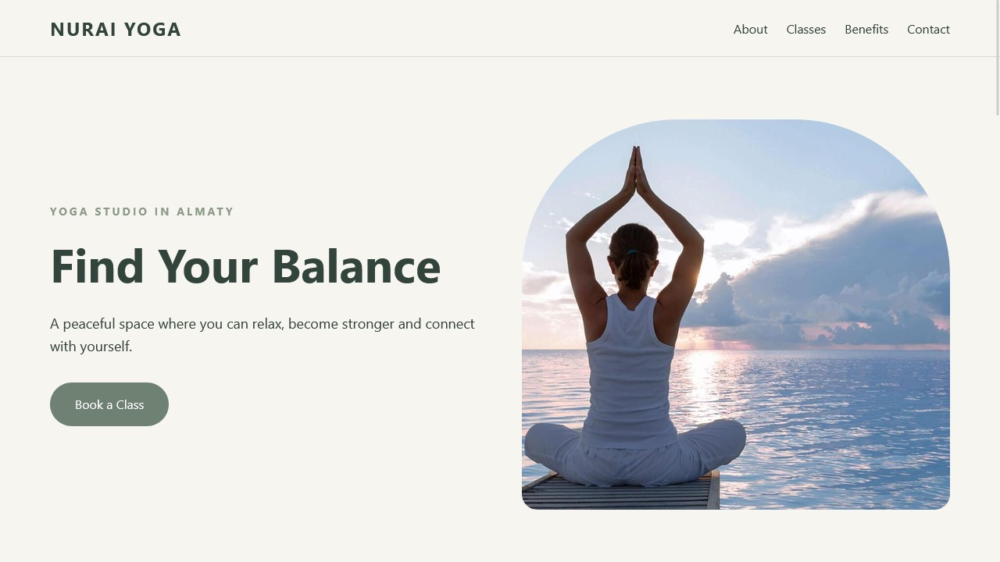

# NURAI YOGA — Responsive Landing Page

## About the Project

**NURAI YOGA** is a responsive landing page for a yoga studio in Almaty.

The website presents information about the yoga studio, available yoga classes, the benefits of yoga, and a contact form for visitors who want to book a class or send a message.

The project was originally created using HTML5 and CSS3 for Lab 2. For Lab 3, the layout was redesigned using **Tailwind CSS** with responsive utility classes.

## Live Website

https://nuraiturgali.github.io/landing-turgali/

## Repository

https://github.com/nuraiturgali/landing-turgali

---

## Technologies Used

- HTML5
- Tailwind CSS
- Tailwind Play CDN
- Flexbox
- CSS Grid
- Responsive Design
- Git and GitHub
- GitHub Pages

Tailwind CSS is connected through the Play CDN:

```html
<script src="https://cdn.jsdelivr.net/npm/@tailwindcss/browser@4"></script>
```

---

## Website Structure

The landing page contains several sections:

### Header and Navigation

The header contains the **NURAI YOGA** logo and navigation links:

- About
- Classes
- Benefits
- Contact

The navigation uses Tailwind Flexbox utilities and changes its layout depending on the screen width.

### Hero Section

The main section introduces the yoga studio with the heading **“Find Your Balance”**, a short description, a call-to-action button, and a yoga image.

### About Section

The About section provides information about the studio and explains that the classes are suitable for both beginners and experienced students.

### Classes Section

The website contains three yoga class cards:

- Morning Yoga
- Relax Yoga
- Power Yoga

The cards use a responsive Tailwind Grid.

### Benefits Section

This section explains several benefits of practicing yoga, including flexibility, stress reduction, concentration, strength, and better sleep.

### Contact Section

The contact section contains an accessible HTML form with:

- Name
- Email
- Message
- Submit button

All form fields have labels and required validation.

### Footer

The footer contains the author information and location.

---

# Responsive Design

The website was designed and tested for three required screen widths:

- **375 px — Mobile**
- **768 px — Tablet**
- **1280 px — Desktop**

Tailwind responsive prefixes such as `sm:`, `md:` and `lg:` are used to change the layout depending on the screen size.

For example, the class cards use:

```html
grid grid-cols-1 sm:grid-cols-2 lg:grid-cols-3
```

This means:

- Mobile — 1 card per row
- Tablet — 2 cards per row
- Desktop — 3 cards per row

The navigation also uses responsive Flexbox utilities:

```html
flex flex-col sm:flex-row
```

On smaller screens the navigation elements can be arranged vertically, while larger screens use a horizontal layout.

Images use responsive widths and `object-cover` so that they stay inside their containers.

The page was also checked to make sure there is no horizontal scrolling.

---

# Screenshots

Below are screenshots of the website at the three required responsive widths.

## Mobile — 375 px

The mobile version uses a single-column layout. The content, images, form, and cards fit within the screen width.



---

## Tablet — 768 px

The tablet version uses more horizontal space. The yoga class cards are displayed in two columns.



---

## Desktop — 1280 px

The desktop version uses the full layout. The class section displays three cards in one row, and larger sections use two-column Grid layouts.



---

# Why I Chose Tailwind CSS

For this project I used Tailwind CSS because it makes responsive layouts easier to build directly in HTML. Instead of writing separate CSS rules for every element, I can use utility classes such as `flex`, `grid`, `px-6`, and `rounded-2xl`. I especially liked the responsive prefixes `sm:`, `md:` and `lg:` because they make it clear how the website changes on different screen sizes. Tailwind also gives me more control over the design than frameworks that mainly provide ready-made components. One disadvantage is that HTML elements can have many classes, which can make the code look long at first. Compared with Sass, Tailwind requires less custom CSS for this landing page because most of the styling can be created with utility classes. Overall, Tailwind was convenient for creating and testing the responsive layout.

---

# Accessibility and SEO

The project includes several HTML5 accessibility and SEO features:

- Semantic HTML elements such as `header`, `nav`, `main`, `section`, `article`, and `footer`
- `alt` text for images
- `label` elements for form fields
- `required` form validation
- Correct heading structure with `h1`, `h2`, and `h3`
- Meta description
- Viewport meta tag
- Page title
- Favicon connection

---

# Git and GitHub

The project is stored in a public GitHub repository and published using GitHub Pages.

The development process was divided into multiple commits so that the progress of Lab 3 can be seen in the repository history.

Main Lab 3 commits include:

1. `Convert layout to Tailwind CSS`
2. `Improve responsive layout and organize images`
3. `Add README and responsive screenshots`

The original HTML5 and CSS3 version from Lab 2 remains available in the Git history.

---

# AI Usage

I used **ChatGPT** during the project as an assistant.

ChatGPT helped me understand Tailwind CSS responsive utilities, organize the responsive layout, work with Git commands, configure GitHub, and structure the README file.

I reviewed the HTML and Tailwind classes used in the project and can explain how the main responsive classes work.

---

# Author

**Nurai Turgali**

Yoga Studio Landing Page  
Almaty, Kazakhstan  
2026
